# Storm Count

A free Magic: The Gathering higher/lower mana-value guessing game.

You're shown two cards: an anchor and a mystery. Guess whether the mystery
card's converted mana cost is higher or lower than the anchor. Chain correct
guesses to raise your Storm Count.

> Storm Count is unofficial fan content, not produced by, endorsed by, or
> affiliated with Wizards of the Coast LLC. Magic: The Gathering®, card names,
> artwork, and mana symbols are © Wizards of the Coast.

---

## Game modes

- **Daily Challenge** — a fixed 50-card sequence everyone plays each calendar
  day (UTC). The seed is generated lazily on the first request of the day,
  stored in `daily_seeds`, and reused for every subsequent player. Scores go
  on a global leaderboard.
- **Survival** — an endless run that ends the instant you guess wrong. Cards
  are sampled randomly from a local card pool. Only your personal best streak
  is kept (`survival_bests`).
- **Themed days** — admin-defined date overrides. On a themed day the daily
  card pool comes from a custom Scryfall query (e.g. `otag:lightsaber` for
  Star Wars Day). See [Admin panel](#admin-panel) below.

---

## Tech stack

| Layer | Choice |
|---|---|
| Framework | [Next.js 16](https://nextjs.org) (App Router, Server Components) |
| UI | React 19 + Tailwind CSS 4 (CSS-first config in `globals.css`) |
| Database | [Neon](https://neon.tech) serverless Postgres via `@neondatabase/serverless` |
| ORM | [Drizzle](https://orm.drizzle.team) with `drizzle-kit push` migrations |
| Auth | [Clerk](https://clerk.com) (custom-page sign-in/sign-up) |
| Card data | [Scryfall](https://scryfall.com) — bulk `oracle_cards` for the pool, live API for themed days |
| Email | [Resend](https://resend.com) for contact + bug-report forms |
| Hosting | [Vercel](https://vercel.com) (serverless) |

---

## Environment variables

Copy `.env.example` to `.env.local` and fill in. Required keys:

| Variable | Purpose |
|---|---|
| `DATABASE_URL` | Neon Postgres connection string (pooled). |
| `DATABASE_URL_UNPOOLED` | Direct (non-pooled) URL — needed by `drizzle-kit` migrations. |
| `NEXT_PUBLIC_CLERK_PUBLISHABLE_KEY` | Clerk publishable key. |
| `CLERK_SECRET_KEY` | Clerk secret key. |
| `NEXT_PUBLIC_CLERK_SIGN_IN_URL` | `/sign-in` |
| `NEXT_PUBLIC_CLERK_SIGN_UP_URL` | `/sign-up` |
| `NEXT_PUBLIC_CLERK_SIGN_IN_FALLBACK_REDIRECT_URL` | `/` |
| `NEXT_PUBLIC_CLERK_SIGN_UP_FALLBACK_REDIRECT_URL` | `/` |
| `SCRYFALL_USER_AGENT` | Friendly UA string sent on every Scryfall call (Scryfall etiquette). |
| `RESEND_API_KEY` | Resend API key for the contact form. |
| `CONTACT_EMAIL` | Inbox that receives contact + bug-report submissions. |

---

## Local development

```bash
# 1. Install
npm install

# 2. Configure env
cp .env.example .env.local
# …fill in DATABASE_URL, Clerk keys, etc.

# 3. Push the schema to your Neon DB
npm run db:push

# 4. Run dev server
npm run dev
```

Open <http://localhost:3000>.

### Database commands

```bash
npm run db:push      # apply schema diff directly (preferred for dev)
npm run db:studio    # open Drizzle Studio (visual DB browser)
npm run db:generate  # generate migration SQL from schema diff
npm run db:migrate   # run pending migration files (production-style)
```

The schema lives at `src/lib/db/schema.ts`. After editing it, run
`npm run db:push` to sync — that's the workflow for everyday changes. Use the
`generate` + `migrate` pair when you need a recorded SQL migration to commit
(e.g. for a paid CI/CD or audit setup).

---

## Architecture

### High-level data flow

```mermaid
flowchart TD
    subgraph daily [Daily mode]
        D1[GET /api/cards/daily] --> D2{daily_seeds row<br/>for today?}
        D2 -->|yes| D7[Return stored seed]
        D2 -->|no| D3{themed_days<br/>match today?}
        D3 -->|yes| D4[generateThemedCards<br/>live Scryfall, throttled]
        D3 -->|no| D5[generateDailyCards<br/>bulk oracle_cards]
        D4 --> D6[INSERT daily_seeds<br/>onConflictDoNothing]
        D5 --> D6
        D6 --> D7
    end

    subgraph survival [Survival mode]
        S1[GET /api/cards/survival] --> S2{themed_days today<br/>is_daily=false?}
        S2 -->|yes| S3[Live Scryfall query<br/>throttled]
        S2 -->|no| S4[SELECT FROM card_pool<br/>ORDER BY random]
        S4 -->|empty| S5[Fallback: live Scryfall]
        S3 --> S6[Return MtgCard array]
        S4 --> S6
        S5 --> S6
    end

    subgraph admin [Admin operations]
        A1[POST /api/admin/refresh-pool] --> A2[Download bulk data<br/>~165 MB]
        A2 --> A3[Filter + upsert card_pool]
        A4[Admin Schedule page] --> A5[POST/DELETE<br/>/api/admin/seed]
        A6[Admin Themed Days page] --> A7[POST<br/>/api/admin/themed-days]
    end
```



### Card sourcing strategy

Live Scryfall search is rate-limited to 2 req/s, so we avoid it on the hot path:

- **Daily seed** — pulls the `oracle_cards` bulk JSON (~165 MB), filters
  in-memory, Fisher-Yates shuffles, and slices to 50 cards. One bulk download
  per seed generation, then nothing until the next themed day.
- **Survival** — `SELECT … FROM card_pool ORDER BY random() LIMIT N`. The
  pool is populated in advance by an admin via `POST /api/admin/refresh-pool`,
  which runs the same bulk download + filter as the daily generator.
- **Themed days** — Scryfall's community **Tagger** tags (e.g.
  `otag:lightsaber`, `art:dragon`) are *not* in bulk data, so themed seeds
  fall back to the live `/cards/search` API. Each request is throttled to
  respect the 2 req/s limit.

### Universal card filters

Both modes pull from the same filtered pool — no mode-specific divergence:

- `game:paper`, `is:default`, `not:extra`, `-is:unset`
- `-t:dungeon -t:land -t:conspiracy -not:token`
- `-mana:{X}` (no variable mana cost — they break higher/lower comparisons)
- `-is:split` (split cards have two faces with different costs)

### Folder layout

```
src/
├── app/
│   ├── (game pages)         page.tsx, daily/, survival/, leaderboard/, profile/
│   ├── (auth)               sign-in/, sign-up/
│   ├── (legal)              about/, privacy/, contact/, bug-report/
│   ├── admin/               layout.tsx (isAdmin gate)
│   │   ├── themed-days/     define recurring or one-off themed days
│   │   └── schedule/        upcoming themes + per-day seed actions
│   └── api/
│       ├── cards/           daily/, survival/, next/
│       ├── scores/          submit/, survival/
│       ├── leaderboard/
│       ├── contact/, bug-report/
│       └── admin/           seed/, themed-days/, refresh-pool/
├── components/              UI components (game, layout, marketing)
├── hooks/                   useDailyGame, useSurvivalGame, etc.
└── lib/
    ├── auth/admin.ts        isAdmin() helper
    ├── db/                  schema.ts, index.ts
    ├── scryfall/            bulkClient, seedGenerator, cardMapper, queries, types
    ├── themedDays.ts        findThemedDayForDate (resolution priority)
    └── types.ts             shared MtgCard, DailySeed, etc.
```

---

## Admin panel

`/admin/*` is gated by the `is_admin` flag on the `users` table. There is no
in-app promote/demote UI — flipping the flag is intentionally a manual DB
operation. To become an admin:

1. Sign in via Clerk **and play a Daily Challenge once** so the `users` row
   gets created (it's inserted lazily on first score submission). Alternatively
   insert the row by hand.
2. Find your Clerk userId (Clerk dashboard → Users → copy "User ID", format
   `user_2abc…`). Make sure you're looking at the **correct Clerk instance**
   (dev and production have separate user databases).
3. Flip the flag via SQL / Drizzle Studio:

   ```sql
   UPDATE users SET is_admin = true WHERE id = 'user_2abc...';
   ```

Both the page layout (`src/app/admin/layout.tsx`) and every `/api/admin/*`
route call `isAdmin()` independently — defence in depth. Each call performs
a single indexed PK lookup against `users`, so the cost is negligible.

### Pages

- **Themed Days** (`/admin/themed-days`) — form to define a themed day plus
  a list of every existing one. Fields: theme name, description, Scryfall
  query, mode (Daily-only vs Daily+Survival), day, month, year. Use `*` for
  the year to make a theme recur every year (e.g. May 4 forever).
- **Schedule** (`/admin/schedule`) — table of every theme's next occurrence
  within 365 days, the corresponding daily-seed status (Seed ready / No seed),
  and per-row actions: **Generate now**, **Regenerate**, **Remove seed**.
  Pre-generating themed seeds is recommended — themed generation takes
  several seconds because it goes through the live Scryfall API.

### Refreshing the survival card pool

Run periodically (every few weeks, after a major MTG set release):

```bash
curl -X POST -H "Authorization: Bearer $CLERK_SESSION_TOKEN" \
  https://your-domain/api/admin/refresh-pool
```

Or call it from a Vercel Cron job. The endpoint downloads ~165 MB of bulk
data, filters, and upserts the result into `card_pool`. Expect 1–3 minutes
end-to-end (`maxDuration` is 5 min).

### Themed-day priority resolution

If a date matches more than one themed-day row, the explicit-year row wins:

| Row A (year=`2026`) | Row B (year=`*`) | Match for 2026-05-04 | Match for 2027-05-04 |
|---|---|---|---|
| Star Wars 2026 | Star Wars Forever | Star Wars 2026 | Star Wars Forever |

This is enforced both at runtime (`findThemedDayForDate` in
`src/lib/themedDays.ts`) and reflected in the admin Schedule page's next-
occurrence computation.

---

## Deployment notes

- **Vercel**: Connect the repo, set the env vars (or use the Neon + Clerk
  Vercel integrations to auto-populate them). The default build command
  (`next build`) is correct.
- **Migrations**: Either run `npm run db:push` from a local machine pointed
  at the production `DATABASE_URL_UNPOOLED`, or commit generated migrations
  (`npm run db:generate`) and run them in a deploy hook.
- **Cron**: An optional Vercel Cron entry can hit `/api/admin/refresh-pool`
  weekly to keep the survival pool fresh. The route requires admin auth, so
  use a service-account session or move the bulk-refresh to a separate
  shared-secret endpoint if you want unauthenticated cron access.
- **Function memory**: `/api/admin/refresh-pool` parses the entire
  ~165 MB bulk JSON in memory. Vercel's default 1 GB serverless memory is
  enough; if you change runtime to Edge it will fail.
